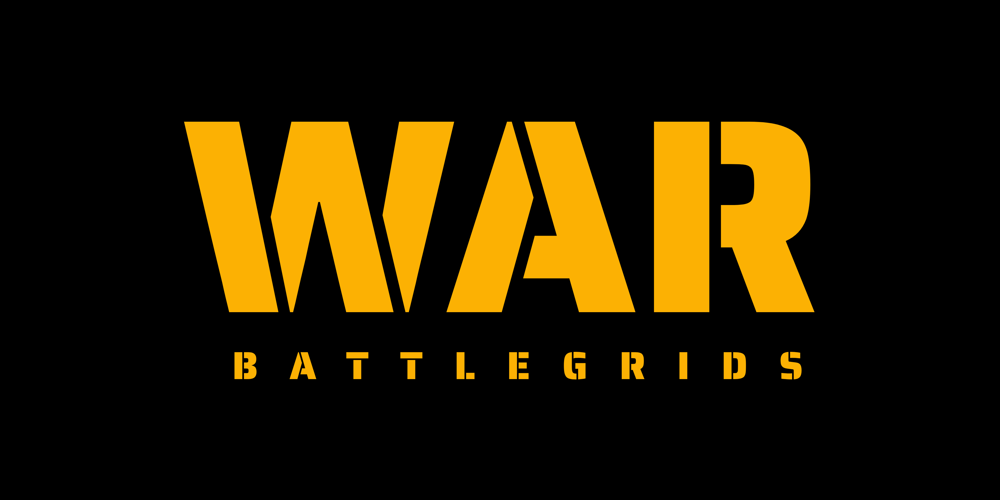

<div align="center">

  

  # ⚔️ WAR: BATTLEGRIDS ⚔️

  **A high-octane, grid-based tactical strategy game built with Flutter & Flame Engine.**

  Command your kingdom, conquer vast territories, and outsmart your opponents in tactical grid combat.

  <br/>

  <a href="https://agk8055.itch.io/war">
    
  </a>

  <br/><br/>

  [](https://flutter.dev)
  [](https://flame-engine.org)
  [](https://riverpod.dev)
  [](https://supabase.com)

</div>

---

## 📖 About the Game

**WAR: BATTLEGRIDS** brings classic tactical turn-based conquest into a modern cross-platform experience. Reclaim lands across an extensive story campaign or challenge rivals worldwide in low-latency multiplayer matches.

### 🎮 Play Now
Download the latest build directly on [itch.io](https://agk8055.itch.io/war):

<a href="https://agk8055.itch.io/war">
  
</a>


---

## 🚀 Features

### 🗺️ Conquest & Story Mode
- **Campaign Progression**: Journey through diverse landscapes — from northern pine forests to ancient coastal forts.
- **Kingdom Conquest**: Defeat rival factions to unlock new kingdoms, territories, and house sigils.
- **Dynamic AI**: Battle strategic AI opponents that analyze the grid and adapt to your tactical moves.

### 👥 Multiplayer Warfare
- **Online Rooms**: Powered by **Supabase Realtime**, host or join matches instantly using simple 5-character room codes.
- **Local Bluetooth**: Duel friends nearby without internet using Google **Nearby Connections**.
- **Same-Device Duel**: Pass-and-play local multiplayer mode on a single screen.

### 🎨 Immersive Aesthetics & Audio
- **Flame Engine Canvas**: Smooth 60 FPS tactical grid rendering powered by the Flame game engine.
- **Thematic Factions**: Customize your house identity — Roman Empire, Viking Clans, Ottoman Dynasty, Pharaohs, and more.
- **Tiled Map Support**: High-fidelity battlefield maps crafted in Tiled, supporting 15x15 skirmishes up to 25x25 grand scale battles.
- **Dynamic Audio**: Immersive soundtrack and sound effects powered by `audioplayers`.

---

## ⚔️ Core Rules & Win Conditions

WAR: BATTLEGRIDS combines territory encirclement with a **Strict 4-Tier Win Hierarchy** and dynamic siege-blockade mechanics:

### 🎯 Surround Captures & Siege Points
- Enclosing enemy units strips their liberties, capturing them for **+10 points** per unit and transforming tiles into permanent **Captured Grids**.
- Accumulating capture points unlocks the **Kingdom Attack Phase**, dropping the opponent's palace barrier.

### 🏆 4-Tier Dynamic Win Condition Hierarchy
The game dynamically evaluates the board and activates the highest viable win condition:

1. **Tier 1 — Full U-Shape Palace Encirclement (`fullUShape`)** *(Primary)*:
   - Connects both flanks (`Top-Left Anchor` to `Top-Right Anchor`) around the opponent's palace base.
   - Active whenever structurally possible on the board.
2. **Tier 2 — Half U-Shape Flank Encirclement (`halfUShape`)**:
   - Connects one board edge to the opposite palace flank (`Left Edge` to `Top-Right` or `Right Edge` to `Top-Left`).
   - Activates **only if** Full U-Shape is structurally impossible.
3. **Tier 3 — Parallel Flank Blockade (`parallel`)**:
   - Connects `Left Edge` to `Right Edge` across the battlefield, cleanly separating the opponent's kingdom.
   - Activates **only if** Half U-Shape is also structurally impossible.
4. **Tier 4 — Royal Siege-Assisted Blockade (`kingdomAssisted`)**:
   - Completes an anchor blockade by utilizing the attacker's own Kingdom Zone.
   - Activates **only if** Parallel blockade is also structurally impossible.

### 🛡️ Dynamic Siege-Blocked Tile Logic
- Prior to unlocking Kingdom Attack, **only moves that complete the currently active tier** are marked with a siege lock and prevented from placement.
- When higher-tier routes are blocked by the defender, the active tier automatically shifts down the hierarchy and dynamically updates siege restrictions.

*For complete tactical details and lore, see [gameplay.md](gameplay.md).*

---

## 🛠️ Technical Stack

| Category | Technology / Package | Purpose |
| :--- | :--- | :--- |
| **Framework** | [Flutter](https://flutter.dev) (Dart) | Cross-platform UI & application core |
| **Game Engine** | [Flame Engine](https://flame-engine.org) + `flame_tiled` | High-performance 2D canvas & Tiled maps |
| **State Management** | [Riverpod](https://riverpod.dev) | Reactive state management & dependency injection |
| **Multiplayer Backend** | [Supabase Realtime](https://supabase.com) | Low-latency P2P broadcast & presence tracking |
| **Local Connectivity** | [Nearby Connections](https://pub.dev/packages/nearby_connections) | Offline local Bluetooth/Wi-Fi Direct P2P battles |
| **Typography** | [Google Fonts](https://fonts.google.com/specimen/Saira+Stencil+One) | Custom game typography (*Saira Stencil One*) |

---

## 🏗️ Architecture Overview

The codebase is built around a **Simulation-First Architecture**. The game logic runs inside a pure Dart `SimulationProvider` completely decoupled from the Flame rendering engine.

```
       ┌────────────────────────┐
       │   SimulationProvider   │  <-- Pure Dart Game Logic
       └───────────┬────────────┘
                   │ State Updates
       ┌───────────▼────────────┐
       │  Flame Game Canvas     │  <-- 60 FPS Tactical Rendering
       └────────────────────────┘
```

### Key Advantages
- ⚡ **Instant Synchronization**: Multiplayer game actions are executed identically across all client state engines.
- 🤖 **AI Evaluation**: The AI uses the exact same simulation logic as human players to compute optimal grid strategies.
- 🎯 **Deterministic State**: Prevents desync issues during online or offline Bluetooth play.

### Multiplayer Protocol
Using **Supabase Realtime Broadcast**, player actions bypass database tables completely to minimize latency and protect privacy:
- **Presence Tracking**: Instant peer detection for connection and disconnection events.
- **Double-Wrapped Payloads**: Structured, secure event routing for game turns, pass events, and state syncs.

---

## 🚦 Getting Started

> [!IMPORTANT]
> **Notice on Game Assets & Fallback Support**: 
> The `assets/` directory (containing custom graphics, audio files, icons, and Tiled `.tmx` maps) is excluded from this public repository (`.gitignore`).
> 
> **You can still build and run the game without adding any asset files!** The application includes a global fallback system so the app runs out-of-the-box:
> - **UI Banners & Images**: Rendered as stylized dark stone-textured fallback panels.
> - **House Sigils & Icons**: Rendered using crisp procedural vector containers.
> - **In-Game Unit Sprites**: Rendered as procedural vector graphics on the Flame canvas.
> - **Tiled Maps**: Rendered as procedurally generated grid boundaries.
> - **Audio**: Sound effects and music are safely muted when files are absent.

### Prerequisites
- [Flutter SDK](https://docs.flutter.dev/get-started/install) (latest stable release)
- Android Studio / VS Code with Flutter extensions
- A [Supabase](https://supabase.com) project (for online multiplayer)

### Quick Setup

1. **Clone the Repository**
   ```bash
   git clone https://github.com/agk8055/war-battlegrids
   cd war
   ```

2. **Install Dependencies**
   ```bash
   flutter pub get
   ```

3. **Configure Environment Variables**
   Copy `.env.example` to `.env` and fill in your Supabase details:
   ```bash
   cp .env.example .env
   ```

4. **Run the Application**
   ```bash
   flutter run
   ```

---

## 📜 License

**WAR: BATTLEGRIDS** is not open source. All rights are reserved by Alan Geo Kurian.

This repository is made available for viewing and evaluation purposes only. You may not copy, modify, distribute, or use this source code for personal or commercial projects. See the [LICENSE](LICENSE) file for full terms and restrictions.

<div align="center">
  <sub>Built with ❤️ using Flutter & Flame Engine</sub>
</div>


