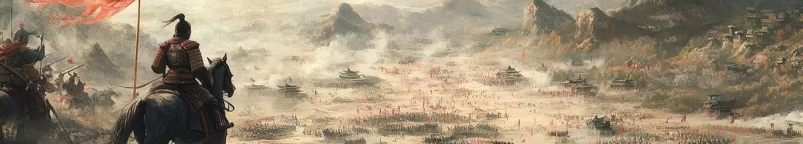
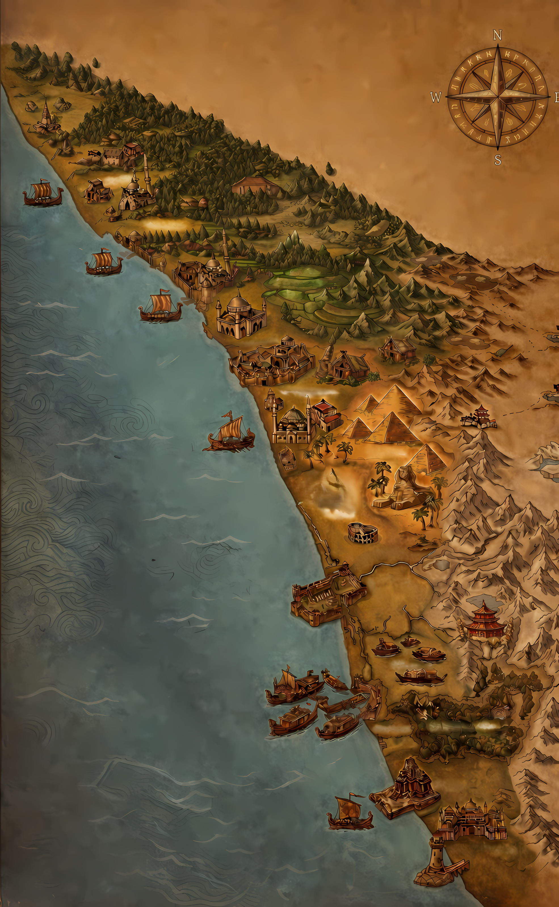
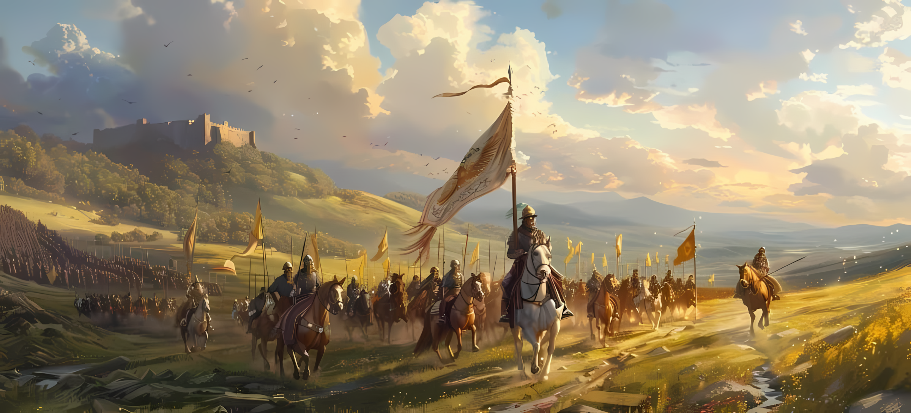

# ⚔️ WAR : BATTLEGRIDS

**WAR: BATTLEGRIDS** is a high-octane, turn-based strategy game built with Flutter and the Flame engine. Command your kingdom, conquer vast territories, and outsmart your opponents in tactical grid-based combat. Whether you're reclaiming lands in the Story Mode or challenging friends across the globe, the battlefield awaits.

---

## 🚀 Features

### 🗺️ Conquest & Story Mode
- **Campaign Progression**: Journey through diverse landscapes—from the northern forests to coastal forts.
- **Kingdom Conquest**: Defeat rival factions to unlock new kingdoms and sigils.
- **Dynamic AI**: Face off against strategic AI that adapts to your moves.

### 👥 Multiplayer Warfare
- **Online Rooms**: Powered by **Supabase Realtime**, join or host rooms with simple 5-character codes. Experience low-latency P2P-style gameplay.
- **Local Bluetooth**: Battle friends nearby using Google's **Nearby Connections**.
- **Same-Device Duel**: Classic local multiplayer for two players on a single device.

### 🎨 Immersive Aesthetics
- **Flame Engine**: Smooth 60FPS tactical gameplay driven by the Flame game engine.
- **Thematic Sigils**: Choose your identity from a wide array of factions—Romans, Vikings, Ottomans, Pharaohs, and more.
- **Tiled Maps**: High-fidelity environments designed in Tiled, ranging from 15x15 skirmishes to 25x25 epic battles.
- **Dynamic Audio**: Immersive soundtracks and tactical sound effects powered by `audioplayers`.

---

## 🛠️ Technical Stack

- **Framework**: [Flutter](https://flutter.dev) (Dart)
- **Game Engine**: [Flame Engine](https://flame-engine.org) & `flame_tiled`
- **State Management**: [Riverpod](https://riverpod.dev)
- **Multiplayer Backend**: [Supabase](https://supabase.com) (Realtime Broadcast & Presence)
- **Local Connectivity**: [Nearby Connections](https://pub.dev/packages/nearby_connections)
- **Local Storage**: `shared_preferences`
- **Typography**: [Google Fonts](https://fonts.google.com/specimen/Saira+Stencil+One) (Saira Stencil One)

---

## 🏗️ Architecture Overview

The game follows a **Simulation-First** architecture. The core game logic resides in a pure Dart `SimulationProvider`, which is completely decoupled from the Flame rendering layer. This allows for:
- **Instant Synchronization**: Moves are processed identically on both devices in multiplayer.
- **AI Simulation**: The AI uses the same simulation logic as the player to evaluate moves.
- **Deterministic Outcomes**: Ensuring consistency across online and local sessions.

### Multiplayer Protocol
The online system uses a **Pure Realtime Broadcast** approach via Supabase, bypassing traditional database tables for maximum performance and privacy.
- **Presence Tracking**: Real-time detection of player connections/disconnections.
- **Double-Wrapped Payloads**: Secure and structured event routing for game moves and sync events.

---

## 🚦 Getting Started

### Prerequisites
- Flutter SDK (latest stable)
- Android Studio / VS Code with Flutter extension
- A Supabase project (for online multiplayer functionality)

### Installation
1. Clone the repository:
   ```bash
   git clone https://github.com/your-username/war.git
   ```
2. Install dependencies:
   ```bash
   flutter pub get
   ```
3. (Optional) Configure Supabase:
   Update the initialization in `lib/main.dart` with your credentials.
4. Run the app:
   ```bash
   flutter run
   ```

---

## 📸 Screenshots

| Home Screen | Campaign Map | Tactical Battle |
| :---: | :---: | :---: |
|  |  |  |

---

## 📜 License

This project is for educational and portfolio purposes. All assets are owned by their respective creators.
